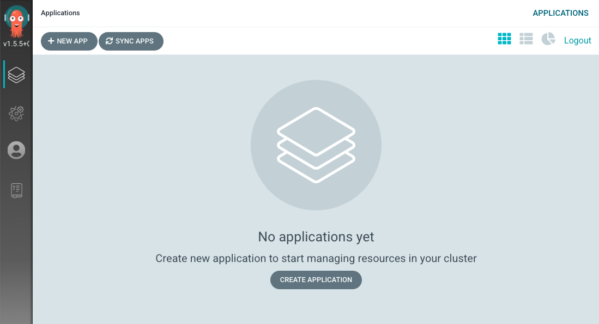
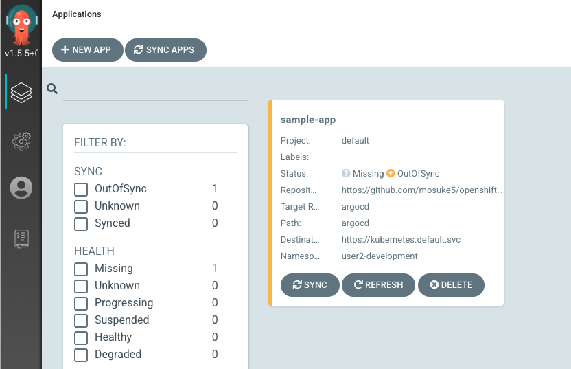

# Argo CDハンズオン
本レポジトリは、CI/CDパイプラインにおいて、GitOps的な考え方を取り入れた際のCD部分を切り出したマニフェストレポジトリであるが、JenkinsのジョブではなくArgo CDを用いたデプロイを体験するためのドキュメントです。

## 事前準備
- Argo CD用のProjectの作成（`oc new-project userX-argocd` で作成）しておくこと
- クラスタ管理者で、事前に利用するProjectに対してArgo CD Operatorをインストールしておくこと
- 本レポジトリをフォークしておくこと

## Argo CDのインストール
Argo CDはOperatorを用いて簡単にインストールすることが可能です。

OpenShiftコンソールのOperators -> Installed Operators -> Argo CD を選択し、`Argo CD`リソースの作成を行う(Create Instanceをクリック)。
以下の用に`spec`以下を書き足し作成する。

```yaml
apiVersion: argoproj.io/v1alpha1
kind: ArgoCD
metadata:
  name: example-argocd
  namespace: userX-argocd
spec:
  server:
    insecure: true
```

Argo CD リソースの設定値については下記から確認が可能。  
[ArgoCD - Argo CD Operator](https://argocd-operator.readthedocs.io/en/latest/reference/argocd/)

Argo CDリソースを作成すると、Argo CD本体を構成するPod群が起動する。
Argo CDのアーキテクチャについては[こちらを確認するといい](https://argoproj.github.io/argo-cd/operator-manual/architecture/)です。

```
$ oc get pod
NAME                                                     READY   STATUS      RESTARTS   AGE
argocd-operator-795c6b6f74-vt4db                         1/1     Running     0          55m
example-argocd-application-controller-55c9b6fd8d-sdt8b   1/1     Running     0          52m
example-argocd-dex-server-75dffb7975-8xdnk               1/1     Running     0          52m
example-argocd-redis-c9cffcffd-4wc8n                     1/1     Running     0          52m
example-argocd-repo-server-744fb56cdf-x5mh8              1/1     Running     0          52m
example-argocd-server-58cbb64849-2nf2t                   1/1     Running     0          52m
```

Argo CDへ外部から接続できるようにRouteを作成します。
Serviceの一覧からArgo CDの本体の`xxxx-server`を探しましょう。それをRouteで公開していきます。

```
$ oc get service
NAME                            TYPE        CLUSTER-IP       EXTERNAL-IP   PORT(S)             AGE
argocd-operator-metrics         ClusterIP   172.30.140.49    <none>        8383/TCP,8686/TCP   26m
example-argocd-dex-server       ClusterIP   172.30.132.127   <none>        5556/TCP,5557/TCP   2m48s
example-argocd-metrics          ClusterIP   172.30.25.177    <none>        8082/TCP            2m48s
example-argocd-redis            ClusterIP   172.30.85.59     <none>        6379/TCP            2m48s
example-argocd-repo-server      ClusterIP   172.30.95.242    <none>        8081/TCP,8084/TCP   2m48s
example-argocd-server           ClusterIP   172.30.201.70    <none>        80/TCP,443/TCP      2m48s
example-argocd-server-metrics   ClusterIP   172.30.17.193    <none>        8083/TCP            2m48s

$ oc expose service example-argocd-server
route.route.openshift.io/example-argocd-server exposed

// Argo CDへアクセスするURLを表示
$ oc get route example-argocd-server -o jsonpath='{.spec.host}'
example-argocd-server-user2-argocd.apps.cluster-3c0e.3c0e.sandbox951.opentlc.com

// Argo CDのデフォルトのadminのパスワード
$ oc get secret example-argocd-cluster -o jsonpath='{.data.admin\.password}' | base64 -d
xxxxxxxxxxxx
```

無事にログインでき、下記の通り画面がでれば成功です。



## Argo CDへのデプロイ権限の付与
Argo CDでは、Gitレポジトリの監視を行い、変更があった場合などに、マニフェストを用いてアプリケーションをデプロイします。
Argo CDが利用するService Account(`argocd-application-controller`)に対して、対象のProjectに対して権限がないとデプロイに失敗します。

`userX` の `X` 部分を適切なものに変更し、権限を付与します。

```
$ oc policy add-role-to-user edit system:serviceaccount:userX-argocd:argocd-application-controller -n userX-application
clusterrole.rbac.authorization.k8s.io/edit added: "system:serviceaccount:user2-argocd:argocd-application-controller"
```

## アプリケーションの作成
Argo CDのコンソールにアクセス後、`NEW APP`を選択しアプリケーションを作成する。
パラメータは以下の通り。

- GENERAL
    - Applicatio Name: 任意
    - Project: `default` を選択
    - SYNC POLICY: `Manual`
- SOURCE:
    - Repository URL: フォークした`openshift-pipeline-practice-java-manifest`のURL
    - Revision: `20200626`
    - Path: `argocd`
- DESTINATION
    - Cluster: `in-cluster`
    - Namespace: `userX-development`

以下のようにトップページにアプリケーションが作成されていれば成功。




作成したアプリケーションは、Argo CDのCRとしても登録せされているので確認しよう。
GUIから作成したが、当然マニフェストとしてArgo CD内の設定も管理できる。

```
$ oc get application -n userX-argocd
NAME                   AGE
sample-app   48m

$ oc get application -n userX-argocd sample-app -o yaml
apiVersion: argoproj.io/v1alpha1
kind: Application
metadata:
  creationTimestamp: "2020-06-21T11:11:40Z"
  generation: 2
  name: sample-app
  namespace: user2-argocd
  resourceVersion: "1120068"
  selfLink: /apis/argoproj.io/v1alpha1/namespaces/user2-argocd/applications/sample-app
  uid: 58f175d7-aa08-48b2-8393-0d1285d0d638
spec:
  destination:
    namespace: user2-development
    server: https://kubernetes.default.svc
  project: default
  source:
    path: argocd
    repoURL: https://github.com/mosuke5/openshift-pipeline-practice-java-manifest
    targetRevision: argocd
...
```

## 変更とデプロイ

## 変更の自動検知とデプロイ